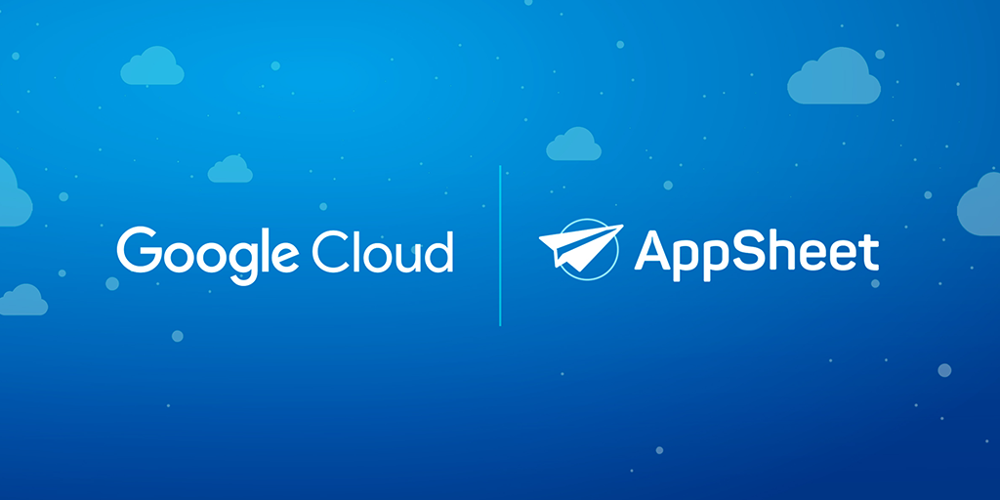

<h1>Cómo Digitalicé un Negocio de Medicina Estética con Herramientas Gratuitas</h1>

En marzo de 2024, una amiga de la familia me pidió ayuda para reorganizar su negocio de medicina estética. El negocio, exitoso en su propuesta estética, enfrentaba un gran desafío tecnológico. Todo se gestionaba de forma manual: expedientes físicos, registros a mano y un archivero que estaba al borde del colapso debido a la cantidad de información acumulada. Para las empleadas, era complicado atender a pacientes nuevos mientras recibían a los recurrentes, generando quejas y retrasos frecuentes en el servicio.

La dinámica era insostenible. Los expedientes ocupaban un archivero completo y desbordado, y mantenerlos organizados era un reto constante. Además, información importante, como cambios en el domicilio o estado de salud de los pacientes, no se actualizaba oportunamente. La dueña del negocio llegó a considerar comprar otro archivero, pero este difícilmente cabría en el local. Esta situación, según ella, era "la gota que derramó el vaso". Intentó buscar soluciones digitales, pero solo encontró opciones costosas, como apps personalizadas que funcionaban offline y en una sola plataforma.

Por mi parte, decidí involucrarme porque quería aprender más sobre herramientas tecnológicas aplicadas a negocios pequeños. Esto me ayudaría a enseñar a mis alumnos de negocios sobre soluciones accesibles y, además, tenía un interés personal: apoyar a mi hermana, quien estaba planeando un negocio propio pero no contaba con presupuesto para digitalizarlo. Este proyecto sería una excelente oportunidad para aprender, ayudar y compartir conocimiento.

<h2>El Reto: Reorganizar un Negocio con Presupuesto Limitado</h2>

El negocio enfrentaba retos importantes, y el presupuesto limitado era el mayor de todos. Mi tarea era encontrar una solución tecnológica que pudiera digitalizar procesos clave sin generar costos adicionales significativos. Las opciones que evalué inicialmente, como sistemas de gestión de pacientes disponibles en el mercado, no ofrecían los módulos personalizados que la dueña necesitaba. En mi experiencia, la personalización y el bajo presupuesto son una combinación que rara vez se encuentra en soluciones comerciales.

El equipo, que incluía a mi hermana, mostró entusiasmo con reservas saludables. Mi hermana estaba especialmente receptiva, mientras que su compañera tenía dudas razonables pero no era resistente al cambio. Al final, me llamaron para implementar algo porque ya las había estado aconsejando sobre posibles soluciones. Esta disposición fue clave para avanzar rápidamente.

Decidí usar <strong>Google AppSheet</strong>, una plataforma gratuita para crear aplicaciones personalizadas que funciona con herramientas como Google Sheets y Google Forms. Elegí AppSheet porque el equipo ya estaba familiarizado con el ecosistema de Google, el cual utilizaban parcialmente con herramientas como Google Calendar. La personalización que ofrecía AppSheet era ideal, ya que permitía satisfacer las necesidades del negocio sin un costo adicional significativo.

<h2>Primera Evaluación: Identificando las Necesidades del Negocio</h2>

Antes de implementar cualquier solución, realicé una evaluación completa de la operación diaria. Aquí algunos de los hallazgos más importantes:

<ul>
  <li>El manejo físico de los expedientes estaba al límite, y la dificultad para organizarlos aumentaba con cada nuevo paciente.</li>
  <li>El almacenamiento de imágenes en una carpeta única hacía complicado mostrar a los pacientes su progreso. Encontrar fotos requería recordar fechas específicas o preguntar al paciente detalles de visitas previas.</li>
  <li>El negocio utilizaba Google Calendar y Google Sheets de forma limitada, pero sin un uso sistemático que integrara estas herramientas.</li>
</ul>

Uno de los mayores retos era garantizar que la solución fuera práctica y útil para el equipo. Al compartir mis ideas con ellas, me mostraron entusiasmo y participaron activamente en el diseño. Este proceso colaborativo fue crucial para asegurar que la solución se adaptara a sus necesidades específicas.

