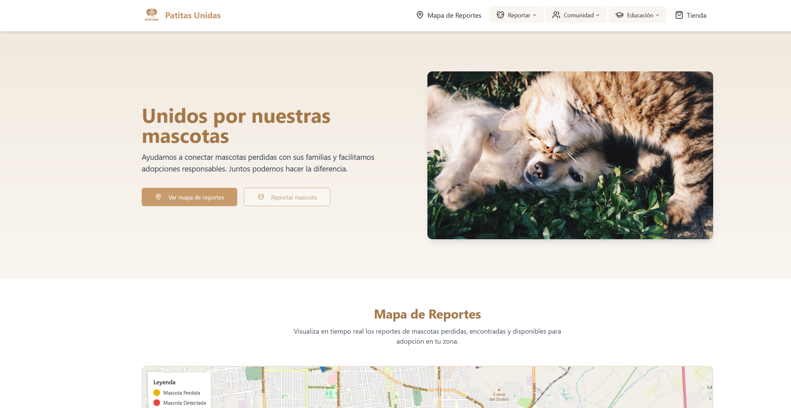
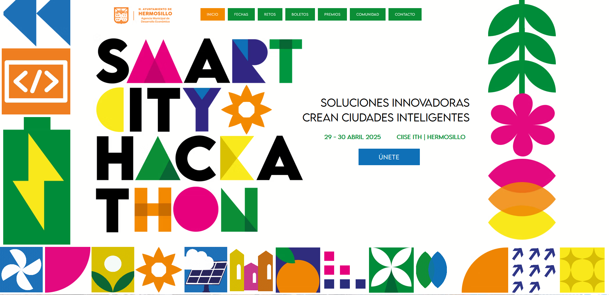

<i>Patitas unidas demo (done with lovable)</i>

**Patitas Unidas** is a mobile app built with **Flutter** and **Dart**, backed by **Firebase**, designed to connect stray or adoptable pets with people looking to give them a home. The project was created during the **Smart City Hackathon in Hermosillo, Sonora**, held on **April 29–30, 2025**.

The app was developed in just **36 hours** as part of a multidisciplinary team, combining developers, designers, and business-oriented participants. It was presented during the final pitch event at **Parque La Ruina** and was selected as one of the **finalist projects**.

### Project Highlights

- **Built in Flutter with Firebase:** Frontend and backend were connected using Firebase services such as Authentication, Firestore, and Storage, demonstrating real-time data handling and cloud-based infrastructure.
- **Rapid prototyping:** Developed under strict time constraints, showcasing the ability to make quick architectural decisions and deliver a functional MVP within 36 hours.
- **Cross-platform development:** The app was designed with both Android and iOS compatibility in mind, using Flutter’s native-like UI capabilities.
- **Teamwork & communication:** The project highlights my ability to work in a collaborative environment and contribute actively in both technical development and team coordination.
- **Public speaking & pitching:** I was in charge of **presenting the final pitch**, demonstrating communication skills and the ability to clearly convey a project's value and purpose to a public audience.
- **Ongoing development:** The app is currently under continued development, with plans to integrate more features such as geolocation, adoption filters, and notification systems.

This project reflects adaptability, initiative, and a strong foundation in mobile app development—especially in high-pressure, time-sensitive contexts like hackathons.

<i>Developed during the Smart City Hackathon (36-hour sprint)</i>
