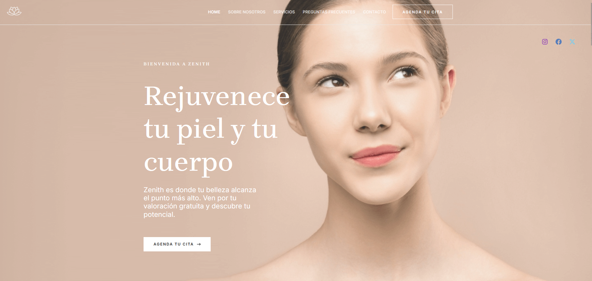
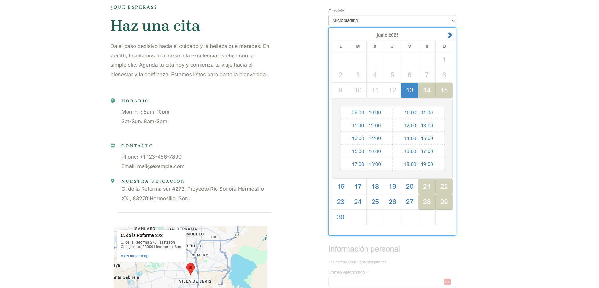

  

<i>Homepage</i>
  

I developed the website for **Zenith Beauty**, an aesthetic medicine center, managing every phase from planning and design to full deployment and infrastructure maintenance.

### Key Highlights

- **Client collaboration:** I worked closely with the client, gathering requirements through direct communication to fully understand their business needs. This needs assessment helped guide both the technical and design decisions.
- **Custom WordPress implementation:** While the foundation is WordPress, I went beyond typical setups by working directly with **MySQL**, using **Linux terminal** for server-side operations, and integrating custom plugins for extended functionality.
- **Development environment:** The project was developed locally using **Local by Flywheel**, enabling efficient offline development and testing before deployment.
- **DigitalOcean deployment:** Infrastructure was configured from scratch, including **droplets**, **DNS setup**, **SSL certificates**, and domain configuration. I also established a basic CI-style flow for ongoing updates.
- **Maintenance and uptime:** The site has been running smoothly with **continuous maintenance for over a year**, showing stability and reliability in both software and infrastructure.
- **Appointment system:** A fully integrated booking system was implemented to allow clients to schedule services online, tailored to the operational needs of the clinic.

---

### Screenshots

|  |  |
|:--:|:--:|
| *Appointment System* | *Mobile View* |
