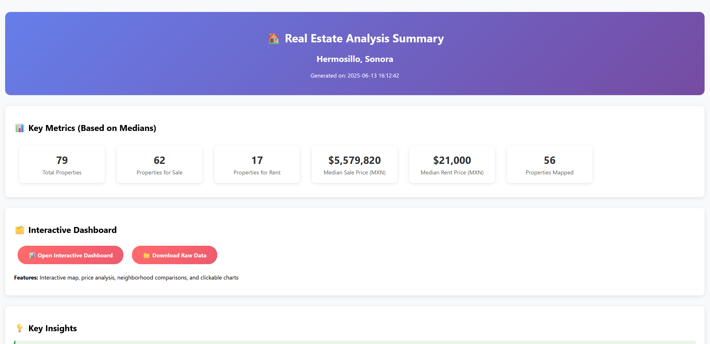
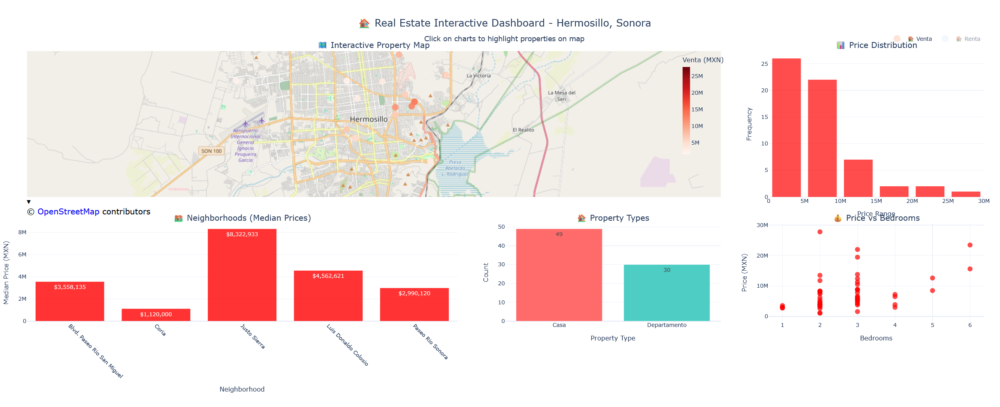

<i>Real state scraper summary</i>

Using **Python** and **Selenium**, I developed a system to scrape data on land and property listings—originally from **Century21**—to help a **construction company** monitor real estate offerings more efficiently. The objective was to automate the process of identifying what properties are currently on the market and at what prices, instead of relying on manual daily reviews.

The data is structured into **CSV files** and then visualized through **interactive geospatial maps** using **Pandas** and **Leaflet**, offering insights into urban zones and market price distribution.

### Project Goals

- Streamline real estate market monitoring for decision-making.
- Automatically collect public data from listing platforms to reduce time spent on manual research.
- Enable future integration with platforms like **Inmuebles24** and others that support automated data access.

While platforms like Facebook Marketplace restrict scraping, the same approach can be applied to a wide range of public real estate websites to create valuable tools for market analysis and urban development strategy.

<i>Real state scraper dashboard</i>
