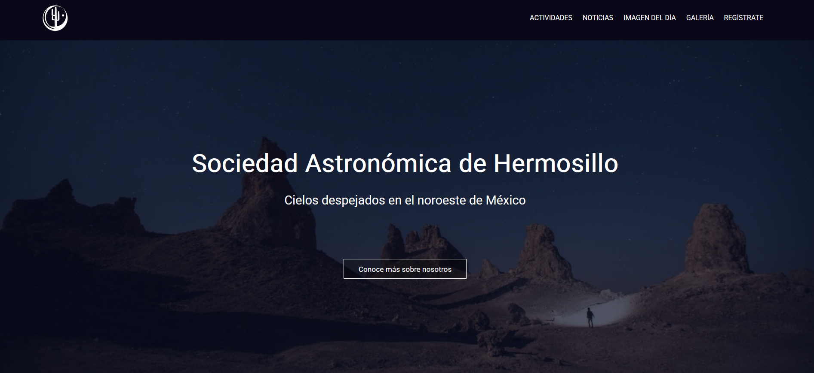

  

<i>Image of the day gallery</i>
  

Website developed for the **Astronomical Society of Hermosillo**, featuring daily space images from NASA’s API, a gallery of local astronomy-related activities, and educational content.

The project was built from scratch using **Vanilla JavaScript**, **HTML**, and **CSS**, and is deployed via **GitHub Pages**. This initiative served as a hands-on exercise to strengthen foundational web development skills and showcase public API integration.

### Project Highlights

- **NASA API integration:** The “Image of the Day” section automatically fetches data from NASA's public API, demonstrating proficiency in handling asynchronous data, working with JSON, and integrating third-party APIs.
- **Educational & community focus:** The site also includes a gallery and informational sections aimed at supporting local astronomy outreach and educational efforts.
- **Performance improvements in progress:** The site is currently being refactored to improve performance through **Lazy Loading**, optimizing asset delivery, and better managing API calls to ensure scalability.
- **Public API-driven architecture:** Beyond NASA’s API, the long-term vision includes feeding the site with multiple public APIs to demonstrate advanced data handling and content automation.
- **Node as package manager:** While the site doesn’t rely on a full framework, **Node.js** is used to manage project dependencies and automate parts of the workflow, following best practices in modern frontend development.

This is an evolving project that reflects a continued commitment to learning, improving code quality, and deepening understanding of web technologies beyond frameworks.

<i>Sociedad Astronómica Homepage</i>
  
